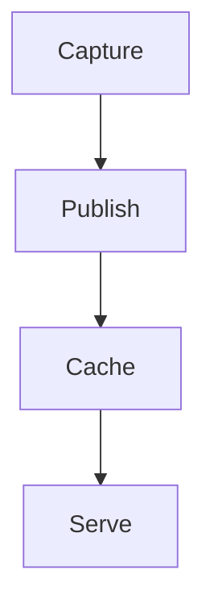
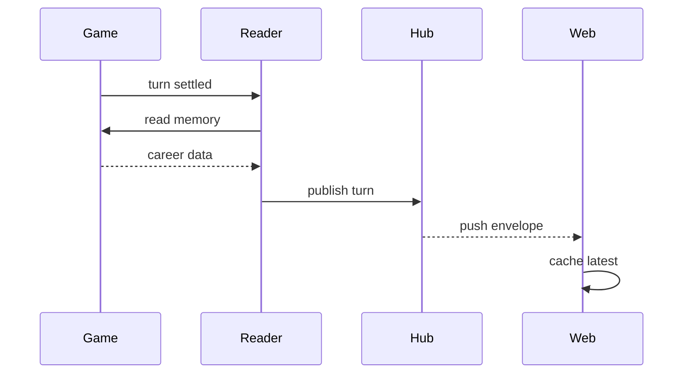
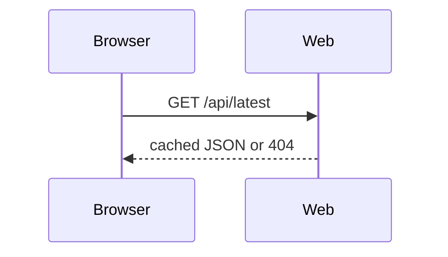

# Terminal Mermaid

Create diagrams for Pi's width-limited Unicode renderer, not for a browser canvas.

## Output rules

- Emit each diagram as a top-level fenced block whose language is exactly `mermaid`.
- Never place the Mermaid fence inside another code fence, blockquote, list item, or table.
- Keep each rendered diagram near 80 columns or fewer.
- Show one interaction or idea per diagram. Split large systems into multiple diagrams.
- Keep important explanation outside the diagram instead of putting paragraphs in labels or notes.
- Prefer simple Mermaid syntax. Avoid YAML frontmatter, init directives, HTML labels, icons, click handlers, custom CSS, and custom themes.
- If Pi shows the Mermaid source instead of a diagram, first make the diagram narrower and simpler.

## Width guidelines

### Sequence diagrams

- Use at most four participants per diagram.
- Keep displayed participant names around 12 characters or fewer.
- Keep message labels around 24 characters or fewer.
- Avoid notes spanning more than two participants.
- Split internal interactions and external/client interactions into separate diagrams.

### Flowcharts

- Prefer `flowchart TD` when a left-to-right chain would become wide.
- Keep rows to four nodes or fewer.
- Use short node labels and move details into prose below the diagram.
- Split overview and detailed flows into separate diagrams.

### Class and ER diagrams

- Include only relationships relevant to the question.
- Omit routine fields and methods unless the user explicitly asks for them.
- Split unrelated aggregates or bounded contexts.

## Process

1. Identify the single idea the diagram must communicate.
2. Choose the smallest suitable diagram type.
3. Draft with short IDs and labels.
4. Check the width guidelines before answering.
5. Split the diagram if it has too many participants, nodes, or long labels.
6. Emit the Mermaid fence at the top level.

## Compact examples

A narrow flowchart:

A narrow sequence diagram:

For a browser request, use a second diagram instead of adding more participants:

